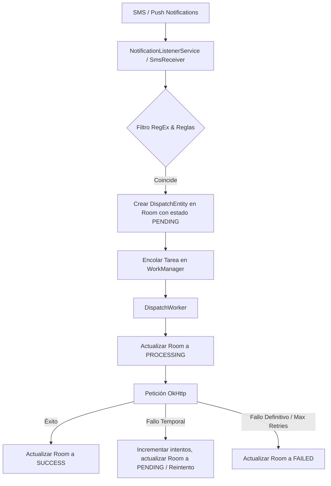

# Guía para Desarrolladores y Agentes de IA

Esta guía documenta el diseño y los flujos críticos de **NotifyBridge** para asistir a futuros ingenieros y agentes autónomos de desarrollo en la expansión del código.

## Arquitectura de Flujo de Datos

## Estructura de Paquetes Clave

- `data.local.entity`: Contiene las definiciones Room de base de datos (`RuleEntity.kt` y `DispatchEntity.kt`).
- `data.local.pref`: Administración de preferencias del usuario mediante DataStore (`AppPreferences.kt`).
- `service`: Clases receptoras de eventos del sistema (`NotificationListener.kt` y `SmsReceiver.kt`).
- `worker`: Gestión de tareas en segundo plano reintentables (`DispatchWorker.kt`).

## Consideraciones Críticas al Realizar Cambios

1. **Permiso de Escucha de Notificaciones:** Es un permiso especial de Android. Recuerda que no se puede conceder automáticamente en tiempo de ejecución. La UI debe redirigir al usuario usando la acción del sistema `Settings.ACTION_NOTIFICATION_LISTENER_SETTINGS`.
2. **Sincronización WorkManager <-> Room:** Para que la bandeja de envíos actualice el estado del Worker en tiempo real, el Worker **siempre** debe actualizar el estado del ID correspondiente en Room. La UI se suscribe al Flow de Room, no al estado de WorkManager directamente.
3. **Cancelaciones:** Si el usuario presiona "Cancelar" en la UI, se debe invocar `WorkManager.getInstance(context).cancelWorkById(uuid)` y simultáneamente actualizar el estado del registro en la base de datos a `DispatchStatus.CANCELLED`.
