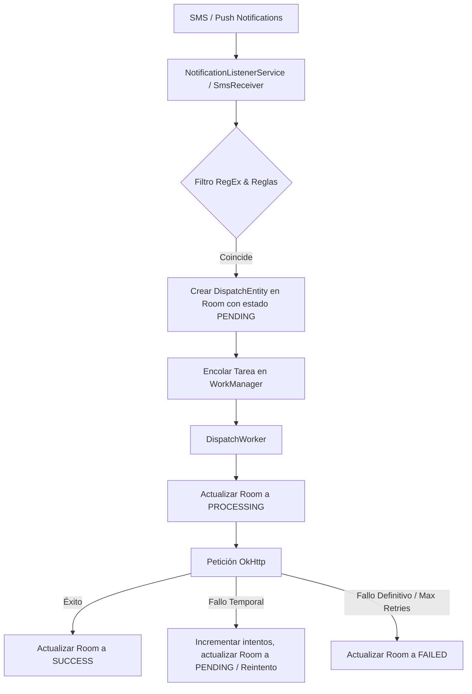

# Guía para Desarrolladores y Agentes de IA

Esta guía documenta el diseño, la arquitectura y los flujos críticos de **NotifyBridge** para asistir a futuros ingenieros y agentes autónomos en la evolución del proyecto.

## Arquitectura de Flujo de Datos

## Estructura de Paquetes Clave

- `data.local.entity`: Definiciones Room (`RuleEntity.kt` y `DispatchEntity.kt`).
- `data.local.pref`: Administración de preferencias del usuario mediante DataStore (`AppPreferences.kt`).
- `service`: Clases receptoras de eventos del sistema (`NotificationListener.kt`, `SmsReceiver.kt`, `BootReceiver.kt`).
- `worker`: Tareas en segundo plano reintentables (`DispatchWorker.kt`).
- `ui`: Actividades y Compose Views (`MainActivity.kt`, `CreateRuleActivity.kt`).

## Consideraciones Críticas al Realizar Cambios

1. **Permiso de Escucha de Notificaciones:** Es un permiso especial de Android. No se concede automáticamente en tiempo de ejecución. La UI debe redirigir al usuario usando `Settings.ACTION_NOTIFICATION_LISTENER_SETTINGS`.
2. **Exclusión de Optimización de Batería (Doze Mode):** Crucial para evitar que el sistema suspenda el proceso o restrinja la red con pantalla apagada. Usar `PowerManager.isIgnoringBatteryOptimizations` y la acción `Settings.ACTION_REQUEST_IGNORE_BATTERY_OPTIMIZATIONS`.
3. **Autoinicio (Boot Readiness):** Registrado `BootReceiver.kt` en `AndroidManifest.xml` para escuchar `BOOT_COMPLETED` y `QUICKBOOT_POWERON`, asegurando estado listo en segundo plano tras el encendido.
4. **Sincronización WorkManager <-> Room:** Para que la bandeja de envíos actualice el estado del Worker en tiempo real, el Worker **siempre** debe actualizar el estado del ID correspondiente en Room. La UI se suscribe al Flow de Room.
5. **Cancelaciones e Historial:** La cancelación actualiza el estado en Room a `DispatchStatus.CANCELLED` e invoca `WorkManager.cancelWorkById(uuid)`. El Historial (SUCCESS / CANCELLED) admite borrado individual o limpieza masiva.
6. **Variables de Plantilla:** Soporta `{not_title}` / `{sms_sender}` (remitente), `{not_text}` / `{sms_text}` (contenido del mensaje SMS o notificación), `{package_name}`, `{timestamp}` y `{global_NOMBRE}`.
7. **Importación y Exportación JSON:** Administrado por `RuleJsonUtil.kt`. Las cabeceras HTTP se exportan en un array de objetos `"headers": [{"header": "Key", "value": "Val"}]` y las variables globales usadas se detectan e inyectan automáticamente en el array `"_vars": [{"name": "VAR", "value": "VAL"}]`. Al importar, las reglas y sus variables globales se integran en la aplicación.
